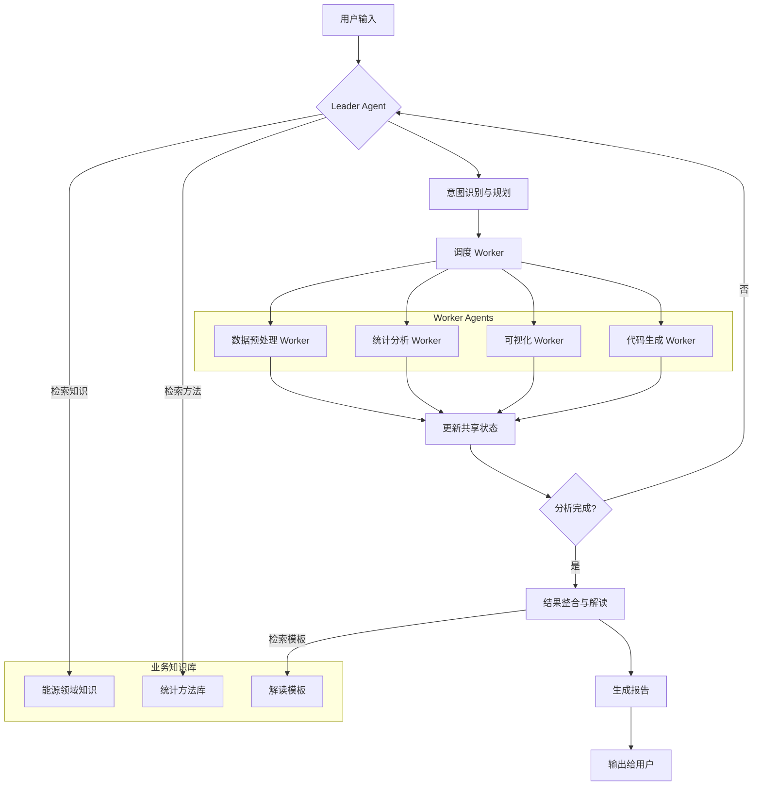

# Mini AutoSTAT: 基于 LangGraph 的多智能体数据分析系统

## 📋 项目概述

Mini AutoSTAT 是一个基于 **LangGraph + langgraph-supervisor** 构建的问题驱动型多智能体数据分析系统。它通过 Leader-Worker 架构实现灵活的数据分析流程编排，支持用户持续提出新假设并动态调整分析策略。Mini AutoSTAT 以能源领域数据分析为例，研究可再生能源的发展与经济增长（GDP）是“先污染后治理”还是“协同发展”的问题，展示 Mini AutoSTAT 的通用统计数据分析功能。

### 核心特性

- **问题驱动分析**：以用户假设为中心，自动规划验证路径
- **可中断与可重规划**：支持用户随时介入，基于已完成工作重新规划流程
- **多模态兼容**：所有可视化输出均提供等价文本表格，确保纯文本 LLM 可用
- **业务知识增强**：通过 RAG 注入能源领域专业知识
- **生产级特性**：状态持久化、断点续跑、流式输出、全链路追踪

## 🛠 技术栈

| 组件 | 技术选型 | 说明 |
|------|----------|------|
| **编排框架** | LangGraph + langgraph-supervisor | 状态图建模、生产级 Agent 编排 |
| **LLM 调用** | LangChain ChatOpenAI | 支持 OpenAI/Anthropic/自定义模型 |
| **状态持久化** | PostgresSaver | 断点续跑、时间旅行调试 |
| **可观测性** | LangSmith | 全链路追踪、路由决策回放 |
| **数据分析** | Pandas, NumPy, Statsmodels | 数据处理与统计分析 |
| **可视化** | Matplotlib, Seaborn | 图表生成（附带等价文本表格） |
| **知识库** | FAISS + sentence-transformers | 业务知识向量存储与检索 |

## 🏗 系统架构



## 📁 目录结构

```
mini-autostat/
├── app.py                    # 主入口
├── requirements.txt          # 依赖清单
├── README.md                 # 本文档
├── agents/                   # Agent 实现
│   ├── leader.py             # Leader Agent (Supervisor)
│   ├── workers/              # Worker Agents
│   │   ├── data_preprocessor.py
│   │   ├── statistical_analyst.py
│   │   ├── visualizer.py
│   │   └── code_generator.py
│   └── __init__.py
├── core/                     # 核心模块
│   ├── state.py              # 状态定义与管理
│   ├── memory.py             # 记忆管理（短期/长期）
│   ├── knowledge_base.py     # 业务知识库（RAG）
│   └── tools/                # 工具集
│       ├── data_tools.py     # 数据处理工具
│       ├── stat_tools.py     # 统计分析工具
│       ├── viz_tools.py      # 可视化工具
│       └── code_tools.py     # 代码执行工具
├── workflows/                # 工作流定义
│   ├── analysis_workflow.py  # 主分析流程
│   └── subworkflows.py       # 子工作流
├── knowledge/                # 知识库内容
│   ├── energy_domain.json    # 能源领域知识
│   ├── statistical_methods.json  # 统计方法说明
│   └── interpretation_templates.json  # 结果解读模板
├── examples/                 # 示例数据
│   └── renewable_energy.csv  # 可再生能源数据
├── tests/                    # 测试用例
│   ├── test_leader.py
│   ├── test_workers.py
│   └── test_integration.py
└── docs/                     # 文档
    ├── architecture.md       # 架构说明
    ├── deployment.md         # 部署指南
    └── api.md                # API 文档
```

## 🎯 核心模块设计

### 1. Leader Agent (Supervisor)

```python
# agents/leader.py
from langgraph_supervisor import create_supervisor
from langchain_openai import ChatOpenAI
from agents.workers import (
    DataPreprocessor,
    StatisticalAnalyst,
    Visualizer,
    CodeGenerator
)

class AnalysisLeader:
    """数据分析团队 Leader"""
    
    def __init__(self, llm=None):
        self.llm = llm or ChatOpenAI(model="gpt-4o")
        self.workers = self._create_workers()
        self.app = self._create_supervisor()
    
    def _create_workers(self):
        return [
            DataPreprocessor(),
            StatisticalAnalyst(),
            Visualizer(),
            CodeGenerator()
        ]
    
    def _create_supervisor(self):
        supervisor = create_supervisor(
            agents=self.workers,
            model=self.llm,
            prompt=self._get_system_prompt()
        )
        return supervisor.compile(
            checkpointer=PostgresSaver.from_conn_string(
                "postgresql://localhost:5432/autostat"
            )
        )
    
    def _get_system_prompt(self):
        return """
你是数据分析团队 Leader，负责协调多个专业 Worker 完成数据分析任务。

## 核心职责
1. **意图识别**：理解用户分析需求，识别是提出新假设、要求中断还是修改参数
2. **任务规划**：将复杂分析拆解为具体步骤，分配给合适的 Worker
3. **质量控制**：检查 Worker 输出，确保结果可靠、可解释
4. **流程管理**：管理分析流程，支持中断、重规划和断点续跑

## Worker 团队
- **数据预处理 Worker**：数据清洗、特征工程、缺失值处理
- **统计分析 Worker**：统计检验、模型构建、结果解读
- **可视化 Worker**：图表生成（必附等价文本表格）
- **代码生成 Worker**：动态生成并执行分析代码

## 决策原则
1. 始终从数据预处理开始，确保数据质量
2. 根据分析类型选择统计方法（描述性→推断性→预测性）
3. 所有可视化必须包含等价文本表格
4. 最终输出结构化报告，包含：数据说明、方法、结果、不确定性、限制

## 终止条件
- 所有分析步骤完成且结果合格
- 用户明确要求停止
- 达到最大迭代次数（防失控）

## 输出格式
分析完成后，输出 FINISH 并附上最终报告。
"""
```

### 2. Worker Agents 实现

```python
# agents/workers/statistical_analyst.py
from langgraph.prebuilt import create_react_agent
from core.tools.stat_tools import (
    run_correlation_test,
    run_granger_causality,
    run_regression_analysis,
    run_descriptive_stats
)

class StatisticalAnalyst:
    """统计分析 Worker"""
    
    def __init__(self):
        self.agent = create_react_agent(
            model=ChatOpenAI(model="gpt-4o"),
            tools=[
                run_correlation_test,
                run_granger_causality,
                run_regression_analysis,
                run_descriptive_stats
            ],
            name="statistical_analyst",
            prompt=self._get_prompt()
        )
    
    def _get_prompt(self):
        return """
你是统计分析专家，负责执行各类统计检验和模型构建。

## 可用工具
1. **描述性统计**：计算均值、标准差、分布等
2. **相关性分析**：皮尔逊/斯皮尔曼相关系数
3. **因果检验**：格兰杰因果检验（需平稳数据）
4. **回归分析**：线性/非线性回归建模

## 工作原则
1. 根据数据类型选择合适方法（参数/非参数）
2. 报告所有统计检验的假设条件
3. 给出效应量而不仅仅是 p 值
4. 明确说明结果的统计显著性和实际意义

## 输出格式
```json
{
  "method": "使用方法",
  "hypothesis": "检验假设",
  "statistics": {"statistic": "值", "p_value": "值", "effect_size": "值"},
  "interpretation": "结果解读",
  "assumptions": ["假设条件1", "假设条件2"],
  "limitations": ["限制1", "限制2"]
}
```
"""
```

### 3. 状态管理

```python
# core/state.py
from typing import TypedDict, Annotated, List, Dict, Optional
from langgraph.graph import add_messages
from datetime import datetime

class AnalysisState(TypedDict):
    """分析会话状态"""
    # 对话历史
    messages: Annotated[List[Dict], add_messages]
    
    # 用户假设与问题
    current_hypothesis: str
    analysis_questions: List[str]
    
    # 数据状态
    data_path: Optional[str]
    data_cleaned: bool
    derived_variables: List[str]
    
    # 分析进度
    completed_steps: List[Dict]  # {"step": "名称", "status": "done", "output": "结果"}
    planned_steps: List[str]
    current_worker: Optional[str]
    
    # 结果存储
    statistical_results: Dict
    visualizations: List[Dict]  # {"path": "图片路径", "text_table": "等价文本"}
    interpretation: Optional[str]
    
    # 流程控制
    interrupted: bool
    interruption_reason: Optional[str]
    max_iterations: int
    current_iteration: int
    
    # 时间戳
    created_at: datetime
    updated_at: datetime
```

### 4. 业务知识库（RAG）

```python
# core/knowledge_base.py
from langchain_community.vectorstores import FAISS
from langchain_openai import OpenAIEmbeddings
import json

class EnergyKnowledgeBase:
    """能源领域知识库"""
    
    def __init__(self):
        self.embeddings = OpenAIEmbeddings()
        self.vector_store = None
        self._load_knowledge()
    
    def _load_knowledge(self):
        """加载并索引知识库"""
        knowledge_chunks = []
        
        # 加载能源领域知识
        with open("knowledge/energy_domain.json", "r") as f:
            for item in json.load(f):
                knowledge_chunks.append(
                    f"标题: {item['title']}\n内容: {item['content']}"
                )
        
        # 创建向量存储
        self.vector_store = FAISS.from_texts(
            knowledge_chunks, 
            self.embeddings
        )
    
    def retrieve_knowledge(self, query: str, k: int = 3) -> List[Dict]:
        """检索相关知识"""
        docs = self.vector_store.similarity_search(query, k=k)
        return [{"content": doc.page_content, "score": doc.metadata.get("score", 0)} for doc in docs]
```

## 🔄 数据分析流程

### 可中断的 Pipeline 设计

```python
# workflows/analysis_workflow.py
from langgraph.graph import StateGraph, END
from core.state import AnalysisState

def create_analysis_workflow():
    """创建可中断的数据分析工作流"""
    
    workflow = StateGraph(AnalysisState)
    
    # 添加节点
    workflow.add_node("intent_analysis", analyze_intent)
    workflow.add_node("data_preprocessing", preprocess_data)
    workflow.add_node("descriptive_stats", run_descriptive_stats)
    workflow.add_node("hypothesis_testing", test_hypothesis)
    workflow.add_node("visualization", create_visualizations)
    workflow.add_node("interpretation", interpret_results)
    workflow.add_node("report_generation", generate_report)
    
    # 设置入口
    workflow.set_entry_point("intent_analysis")
    
    # 条件路由
    workflow.add_conditional_edges(
        "intent_analysis",
        route_based_on_intent,
        {
            "new_analysis": "data_preprocessing",
            "continue": "hypothesis_testing",
            "interrupt": END,
            "replan": "intent_analysis"
        }
    )
    
    # 数据预处理后进入描述性统计
    workflow.add_edge("data_preprocessing", "descriptive_stats")
    
    # 描述性统计后根据用户选择进入假设检验
    workflow.add_conditional_edges(
        "descriptive_stats",
        route_to_hypothesis_test,
        {
            "test_correlation": "hypothesis_testing",
            "test_causality": "hypothesis_testing",
            "test_regression": "hypothesis_testing",
            "skip": "visualization"
        }
    )
    
    # 假设检验后进入可视化
    workflow.add_edge("hypothesis_testing", "visualization")
    
    # 可视化后进入结果解读
    workflow.add_edge("visualization", "interpretation")
    
    # 结果解读后生成报告
    workflow.add_edge("interpretation", "report_generation")
    
    # 报告生成后结束
    workflow.add_edge("report_generation", END)
    
    return workflow.compile()
```

### 中断与重规划机制

```python
# agents/leader.py 中的中断处理
def handle_interruption(state: AnalysisState) -> dict:
    """处理用户中断"""
    return {
        "interrupted": True,
        "interruption_reason": state.get("interruption_reason", "用户主动中断"),
        "current_worker": None,
        "planned_steps": []  # 清空后续计划
    }

def resume_from_interruption(state: AnalysisState) -> dict:
    """从中断点恢复"""
    # 保留已完成步骤
    completed = state.get("completed_steps", [])
    
    # 根据新假设重新规划
    new_plan = plan_new_analysis(
        state["current_hypothesis"],
        completed
    )
    
    return {
        "interrupted": False,
        "planned_steps": new_plan,
        "current_iteration": state["current_iteration"] + 1
    }
```

## 📊 可视化与文本表格等价输出

### 实现方案

```python
# core/tools/viz_tools.py
import matplotlib.pyplot as plt
import pandas as pd
from typing import Dict, List, Tuple

def create_visualization_with_text_table(
    data: pd.DataFrame,
    plot_type: str,
    title: str,
    x_col: str,
    y_col: str,
    hue_col: str = None
) -> Tuple[str, str]:
    """
    创建可视化并生成等价文本表格
    
    Returns:
        (image_path, text_table) 图片路径和等价文本表格
    """
    # 创建图表
    fig, ax = plt.subplots(figsize=(10, 6))
    
    if plot_type == "scatter":
        if hue_col:
            for hue_val in data[hue_col].unique():
                mask = data[hue_col] == hue_val
                ax.scatter(data[mask][x_col], data[mask][y_col], label=hue_val)
        else:
            ax.scatter(data[x_col], data[y_col])
        ax.set_xlabel(x_col)
        ax.set_ylabel(y_col)
    
    elif plot_type == "line":
        if hue_col:
            for hue_val in data[hue_col].unique():
                mask = data[hue_col] == hue_val
                ax.plot(data[mask][x_col], data[mask][y_col], marker='o', label=hue_val)
        else:
            ax.plot(data[x_col], data[y_col], marker='o')
        ax.set_xlabel(x_col)
        ax.set_ylabel(y_col)
    
    elif plot_type == "bar":
        data.groupby(x_col)[y_col].mean().plot(kind='bar', ax=ax)
        ax.set_xlabel(x_col)
        ax.set_ylabel(f"平均{y_col}")
    
    ax.set_title(title)
    if hue_col:
        ax.legend()
    
    # 保存图片
    image_path = f"visualizations/{title.replace(' ', '_').lower()}.png"
    plt.savefig(image_path, bbox_inches='tight', dpi=300)
    plt.close()
    
    # 生成等价文本表格
    text_table = generate_text_table(data, plot_type, title, x_col, y_col, hue_col)
    
    return image_path, text_table

def generate_text_table(
    data: pd.DataFrame,
    plot_type: str,
    title: str,
    x_col: str,
    y_col: str,
    hue_col: str = None
) -> str:
    """生成图表的等价文本表示"""
    text = f"[图表类型: {plot_type}]\n"
    text += f"[标题: {title}]\n"
    text += f"[X轴: {x_col}]\n"
    text += f"[Y轴: {y_col}]\n"
    
    if hue_col:
        text += f"[分组变量: {hue_col}]\n"
    
    # 添加统计摘要
    text += f"[数据点数量: {len(data)}]\n"
    text += f"[X范围: {data[x_col].min()} - {data[x_col].max()}]\n"
    text += f"[Y范围: {data[y_col].min()} - {data[y_col].max()}]\n"
    
    # 添加相关系数（如果是散点图）
    if plot_type == "scatter":
        corr = data[x_col].corr(data[y_col])
        text += f"[相关系数: {corr:.3f}]\n"
    
    # 添加分组摘要
    if hue_col:
        text += "\n[分组摘要:]\n"
        for group in data[hue_col].unique():
            group_data = data[data[hue_col] == group]
            text += f"  {group}:\n"
            text += f"    数量: {len(group_data)}\n"
            text += f"    {x_col}均值: {group_data[x_col].mean():.2f}\n"
            text += f"    {y_col}均值: {group_data[y_col].mean():.2f}\n"
    
    # 添加数据点详情（前10个）
    text += "\n[数据点详情(前10个):]\n"
    for idx, row in data.head(10).iterrows():
        text += f"  {idx}: {x_col}={row[x_col]}, {y_col}={row[y_col]}"
        if hue_col:
            text += f", {hue_col}={row[hue_col]}"
        text += "\n"
    
    return text
```

## 🧠 记忆与上下文管理

### 短期记忆（工作内存）

```python
# core/memory.py
from typing import List, Dict, Optional
from datetime import datetime
import json

class ShortTermMemory:
    """短期记忆管理器"""
    
    def __init__(self, session_id: str):
        self.session_id = session_id
        self.context = self._initialize_context()
    
    def _initialize_context(self) -> Dict:
        return {
            "session_id": self.session_id,
            "created_at": datetime.now().isoformat(),
            "current_hypothesis": None,
            "analysis_questions": [],
            "completed_steps": [],
            "planned_steps": [],
            "statistical_results": {},
            "visualizations": [],
            "interruptions": []
        }
    
    def update_context(self, updates: Dict):
        """更新上下文"""
        for key, value in updates.items():
            if key in self.context:
                if isinstance(self.context[key], list) and isinstance(value, list):
                    self.context[key].extend(value)
                else:
                    self.context[key] = value
        
        self.context["updated_at"] = datetime.now().isoformat()
    
    def add_interruption(self, reason: str):
        """记录中断"""
        self.context["interruptions"].append({
            "timestamp": datetime.now().isoformat(),
            "reason": reason
        })
    
    def get_context_for_llm(self) -> str:
        """获取用于 LLM 的上下文字符串"""
        # 只包含最近3个步骤和关键信息，避免上下文膨胀
        recent_steps = self.context["completed_steps"][-3:]
        
        context_str = f"""
## 当前会上下文
**会话ID**: {self.session_id}
**当前假设**: {self.context['current_hypothesis']}
**已完成步骤**:
{json.dumps(recent_steps, indent=2)}

**统计结果**:
{json.dumps(self.context['statistical_results'], indent=2)}

**中断历史**:
{json.dumps(self.context['interruptions'], indent=2)}
"""
        return context_str
```

### 长期记忆（业务知识库）

```python
# core/knowledge_base.py 中的检索增强
def get_analysis_context(self, query: str) -> str:
    """获取分析上下文，包含业务知识"""
    # 检索相关知识
    knowledge = self.retrieve_knowledge(query, k=3)
    
    # 检索统计方法
    methods = self.retrieve_methods(query, k=2)
    
    # 组合上下文
    context = f"""
## 业务知识背景
{chr(10).join([k['content'] for k in knowledge])}

## 推荐统计方法
{chr(10).join([m['content'] for m in methods])}
"""
    return context
```

## 🚀 部署与运行

### 环境配置

```bash
# requirements.txt
langgraph>=0.2.0
langgraph-supervisor>=0.1.0
langchain-openai>=0.1.0
langchain-community>=0.0.20
pandas>=2.0.0
numpy>=1.24.0
matplotlib>=3.7.0
seaborn>=0.12.0
statsmodels>=0.14.0
scikit-learn>=1.3.0
faiss-cpu>=1.7.4
sentence-transformers>=2.2.0
langsmith>=0.1.0
```

### 启动命令

```bash
# 1. 克隆项目
git clone https://github.com/yourusername/mini-autostat.git
cd mini-autostat

# 2. 安装依赖
pip install -r requirements.txt

# 3. 配置环境变量
export OPENAI_API_KEY=your_key_here
export LANGSMITH_API_KEY=your_key_here
export DATABASE_URL=postgresql://localhost:5432/autostat

# 4. 初始化数据库
python -m core.state init-db

# 5. 加载知识库
python -m core.knowledge_base load

# 6. 启动应用
python app.py --mode interactive
```

### 使用示例

```python
# app.py
from agents.leader import AnalysisLeader
from core.memory import ShortTermMemory

def main():
    # 初始化 Leader Agent
    leader = AnalysisLeader()
    
    # 创建会话
    session_id = "user_session_001"
    memory = ShortTermMemory(session_id)
    
    # 用户输入示例
    user_input = """
    我想验证假设：可再生能源发展与GDP增长存在正相关关系。
    请使用全球可再生能源发电量数据集进行分析。
    """
    
    # 更新上下文
    memory.update_context({
        "current_hypothesis": "可再生能源发展与GDP增长存在正相关关系",
        "data_path": "examples/renewable_energy.csv"
    })
    
    # 执行分析
    result = leader.app.invoke(
        {"messages": [{"role": "user", "content": user_input}]},
        config={"configurable": {"thread_id": session_id}}
    )
    
    # 输出结果
    print("分析完成！")
    print(f"最终报告: {result['final_report']}")

if __name__ == "__main__":
    main()
```

## 📈 考核要求对应

### Mini AutoSTAT 题目 B 要求实现

| 考核要求 | 实现方案 | 状态 |
|---------|---------|------|
| **读取自然语言分析问题** | Leader Agent 意图识别 | ✅ |
| **检查变量类型、缺失值** | 数据预处理 Worker | ✅ |
| **提出分析计划** | Leader 任务规划 | ✅ |
| **自动生成并执行分析代码** | 代码生成 Worker | ✅ |
| **检查模型假设、运行错误** | 统计分析 Worker + 异常处理 | ✅ |
| **输出结构化报告** | 报告生成节点 | ✅ |
| **说明方法选择原因** | 业务知识库增强 | ✅ |
| **说明方法适用条件** | 统计方法知识库 | ✅ |

### 统一功能要求实现

| 功能要求 | 实现方案 | 状态 |
|---------|---------|------|
| **任务规划** | Leader Agent 路由决策 | ✅ |
| **真实工具调用** | Worker Agents 工具调用 | ✅ |
| **状态记录** | ShortTermMemory + StateGraph | ✅ |
| **结果检查** | Leader 质量控制 | ✅ |
| **终止机制** | MAX_TURNS 硬上限 | ✅ |
| **异常处理** | Worker 异常捕获与重试 | ✅ |
| **可配置性** | 环境变量 + 命令行参数 | ✅ |
| **可复现性** | requirements.txt + README | ✅ |

## 🔧 扩展接口

### MCP Tool 集成

```python
# 预留 MCP Tool 接口
class MCPToolInterface:
    """MCP Tool 标准接口"""
    
    def __init__(self, tool_name: str, tool_config: Dict):
        self.tool_name = tool_name
        self.config = tool_config
    
    async def execute(self, input_data: Dict) -> Dict:
        """执行工具"""
        raise NotImplementedError
    
    def get_schema(self) -> Dict:
        """获取工具 Schema"""
        raise NotImplementedError
```

### 多 Agent 协作

```python
# 预留多 Agent 协作接口
class CollaborativeWorkflow:
    """协作工作流接口"""
    
    def __init__(self, agents: List[Agent]):
        self.agents = agents
    
    async def run_collaborative_task(self, task: str) -> Dict:
        """运行协作任务"""
        raise NotImplementedError
```

## 📚 参考资源

- [LangGraph 官方文档](https://langchain-ai.github.io/langgraph/)
- [langgraph-supervisor 源码](https://github.com/langchain-ai/langgraph-supervisor)
- [LangSmith 追踪平台](https://smith.langchain.com/)
- [Our World in Data 能源数据集](https://github.com/owid/energy-data)

## 🤝 贡献指南

欢迎提交 Issue 和 Pull Request。对于重大更改，请先开 Issue 讨论您想要更改的内容。

## 📄 许可证

MIT License

---

**文档版本**: 1.0.0  
**最后更新**: 2026-09-02  
**维护者**: 你的名字