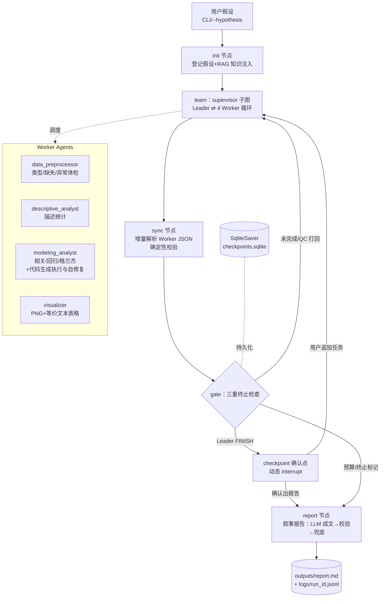

# Mini AutoSTAT: 基于 LangGraph 的多智能体统计分析系统

## 📋 项目概述

Mini AutoSTAT 是一个基于 **LangGraph + langgraph-supervisor** 构建的问题驱动型多智能体统计分析系统（考核题目 B）。用户以自然语言提出分析假设，系统自动完成：数据体检 → 方法选择 → 统计分析（含受限代码生成与执行）→ 可视化 → 问题驱动的叙事结构报告，全程支持用户中断、追加任务与断点续跑。

以能源领域为例：研究可再生能源发展（`renewables_share_energy`）与经济增长（`gdp`）的关系，数据来自 Our World in Data 公开数据集（示例子集见 `examples/`）。

### 核心特性

- **问题驱动分析**：Leader 将自然语言假设拆解为步骤，调度 4 个专业 Worker 逐项完成
- **两类交互暂停点**：team 执行前可注入新指令/终止；Leader 每轮完工后可追加任务或出报告（动态 `interrupt` + `Command(resume=...)`）
- **三重终止机制**：全部完成且合格 / `max_turns` 硬上限 / 用户主动停止——避免 Agent 无限循环
- **双层质量控制**：Leader 提示词内即时打回（最多 2 次）+ sync 节点确定性 JSON 校验，不合格自动回环；Worker 未输出约定 JSON 时从真实工具执行结果确定性降级归档（D-031），杜绝空转误判
- **叙事结构报告（六要素为内容清单）**：按问题驱动叙事组织——问题与数据 → 分析过程 → 主要发现 → 可靠性 → 局限与适用边界 → 结论；考核六要素（数据说明/方法及选择原因/结果/不确定性/限制/不应得出的结论）确定性嵌入对应章节；图表以 Markdown 图片语法嵌入；LLM 成文 → 确定性校验 → 兜底降级三层保障，内容只引用真实运行结果
- **CLI 实时进度展示**（D-030）：stream 流式消费工作流事件，实时打印 Leader 调度、Worker 工具调用与交接摘要、质检判定、收敛原因
- **真实工具调用与代码自修复**：数据处理/统计/可视化均为原生 Python 工具；建模 Worker 可生成 pandas/statsmodels 代码在受限子进程中执行，报错自动修复（最多 `max_repair_rounds` 轮）
- **多模态兼容**：每张图表附带等价文本表格（坐标轴、数据范围、统计摘要），纯文本环境可用
- **图表全英文渲染**（D-032）：PNG 内标题/轴/图例一律英文，中文标题确定性回退为 `"{y} vs {x}"`，规避中文字体渲染问题
- **全链路记录**：每个节点的决策、工具调用、输出、错误逐行写入 `logs/run_<id>.jsonl`
- **RAG 预留接口**：`BaseRetriever` 抽象 + 工厂注册，内置静态方法目录占位，未来接入真实向量检索零改动工作流

## 🛠 技术栈

| 组件    | 技术选型                                    | 说明                                                                                                                          |
| ----- | --------------------------------------- | --------------------------------------------------------------------------------------------------------------------------- |
| 编排框架  | LangGraph + langgraph-supervisor        | 外层控制图 + supervisor 子图（Leader-Worker）                                                                                        |
| LLM   | LangChain ChatOpenAI（OpenAI-compatible） | 任何兼容接口均可；**Leader / Worker 分模型**（D-026）：Leader 质量优先（GLM-5.3-Flash + 思考链），Worker 吞吐优先（DeepSeek-V4-Flash + 无思考链），均经 `.env` 可配；报告生成专属模型（D-039）Qwen3.8-Flash（思考链 + reasoning_effort xhigh，GLM 对报告级长调用间歇性 500） |
| 状态持久化 | SqliteSaver                             | 断点续跑、中断恢复；升级 PostgresSaver 仅改 `workflows/graph.py` compile 一处                                                               |
| 数据分析  | Pandas, Statsmodels, SciPy              | 描述统计、相关/回归/格兰杰检验（含假设条件前置检查）                                                                                                 |
| 可视化   | Matplotlib                              | PNG 输出 + 等价文本表格                                                                                                             |
| 运行记录  | 自研 RunTracer（jsonl）                     | 每步决策、工具调用、输出、错误、下一步                                                                                                         |
| 测试    | pytest                                  | 离线冒烟测试 36 项（M1–M6），不调用真实 LLM                                                                                                |

## 🏗 系统架构



要点：**子图编译时显式** **`checkpointer=False`**（嵌套子图继承父图 checkpointer 会引发 checkpoint 写死锁，见 Decision\_Log D-020）；持久化只在外层图。

## 🚀 快速开始

### 1. 环境要求

- Windows / Linux / macOS，Python 3.11+
- 任一 OpenAI-compatible LLM API（默认配置指向 OpenCode GLM-5.3-Flash，可用任意兼容服务替换）

### 2. 安装

```powershell
git clone <repo-url>; cd mini_autostat
python -m venv .venv
.venv\Scripts\pip install -r requirements.txt   # Linux/macOS: .venv/bin/pip
```

### 3. 配置

```powershell
Copy-Item .env.example .env    # Linux/macOS: cp .env.example .env
# 编辑 .env 填入 OPENAI_API_KEY 等（见下表；.env 已被 .gitignore 排除）
```

| 环境变量                                                    | 说明                                                            | 默认                              |
| ------------------------------------------------------- | ------------------------------------------------------------- | ------------------------------- |
| `OPENAI_API_KEY`                                        | LLM API 密钥（必填）                                                | 无                               |
| `OPENAI_BASE_URL`                                       | OpenAI-compatible 接口地址                                        | `https://opencode.ai/zen/go/v1` |
| `OPENAI_MODEL`                                          | 通用/回退模型名                                                      | `glm-5.3-flash`                 |
| `OPENAI_LEADER_MODEL`                                   | Leader 专属模型（未设置回退 `OPENAI_MODEL`）                             | 未设置                             |
| `OPENAI_WORKER_MODEL`                                   | Worker 专属模型（未设置回退 `OPENAI_MODEL`）                             | 未设置                             |
| `OPENAI_REPORT_MODEL`                                   | 报告生成专属模型（未设置回退 Leader 模型，D-039）                        | `qwen3.8-flash`                 |
| `OPENAI_REPORT_EXTRA_BODY`                              | 报告生成请求附加字段 JSON（思考链/推理力度，D-039）                       | `{"enable_thinking": true, "reasoning_effort": "xhigh"}` |
| `OPENAI_LEADER_EXTRA_BODY` / `OPENAI_WORKER_EXTRA_BODY` | 随请求体透传的 JSON 附加字段（如思考链开关 `{"thinking": {"type": "enabled"}}`） | 未设置                             |
| `OPENAI_TEMPERATURE`                                    | 可选；设置后强制覆盖所有 Agent 的 temperature（部分模型如 kimi-k2.6 仅允许 1）       | 不设置（0.0）                        |
| `MAX_TURNS` / `MAX_REPAIR_ROUNDS`                       | 运行预算（可被命令行覆盖）                                                 | 12 / 3                          |

### 4. 一条命令运行

```powershell
.venv\Scripts\python.exe app.py --data owid-energy-data.csv --hypothesis "2000-2023 年中国可再生能源发展与 GDP 增长的关系"
```

交互式输入假设（不传 `--hypothesis` 时提示输入，回车用内置示例）。完整 CLI 参数：

| 参数                                  | 说明                              | 默认                                                             |
| ----------------------------------- | ------------------------------- | -------------------------------------------------------------- |
| `--data`                            | CSV 数据路径                        | `owid-energy-data.csv`                                         |
| `--hypothesis`                      | 自然语言分析假设                        | 交互输入                                                           |
| `--max-turns`                       | Leader 调度步数硬上限                  | 12                                                             |
| `--max-repair-rounds`               | 建模代码自修复最大轮数                     | 3                                                              |
| `--retriever`                       | 知识检索 provider：`null` / `static` | `null`                                                         |
| `--model`                           | 覆盖通用模型名                         | `OPENAI_MODEL`                                                 |
| `--leader-model` / `--worker-model` | 覆盖 Leader/Worker 专属模型名          | `OPENAI_LEADER_MODEL` / `OPENAI_WORKER_MODEL`（未设置回退 `--model`） |
| `--report-model` | 覆盖报告生成专属模型名 | `OPENAI_REPORT_MODEL`（未设置回退 Leader 模型） |
| `--output-dir` / `--log-dir`        | 输出/日志目录                         | `outputs` / `logs`                                             |

### 5. 交互暂停点协议与实时进度

CLI 运行全程实时打印工作流进度（stream 流式消费，D-030）：`[调度] Leader → worker：任务`、`· worker：工具名`（工具调用）、`[完成] worker：交接摘要`、`[质检] …→ ok/不合格，打回`、`[系统] …`（打回/完整性反馈）、`[收敛] …`（终止原因）、`[报告] 已生成（约 N 字）`。

两类暂停点协议：

| 暂停点     | 时机                                         | 回车     | `stop`   | 输入其他文本           |
| ------- | ------------------------------------------ | ------ | -------- | ---------------- |
| **中断点** | team 首轮**自动继续不打断**（D-033）；QC 回环/追加任务轮执行前询问 | 继续     | 终止并收敛到报告 | 注入新指令，Leader 重规划 |
| **确认点** | Leader 每轮 FINISH 后                         | 生成报告结束 | 生成报告结束   | 追加任务，基于已完成工作继续   |

运行中 `Ctrl+C`：落在最近的 super-step 边界，写入终止标记后收敛到报告，已有成果不丢失。

### 6. 使用示例数据快速演示

```powershell
.venv\Scripts\python.exe app.py --data examples\renewable_energy_gdp.csv --max-turns 6 `
    --hypothesis "对比中美两国 2000-2023 年可再生能源占比与 GDP 的描述统计"
```

## 📁 目录结构

```
mini_autostat/
├── app.py                        # 交互式 CLI 主入口（实时进度 + 两类暂停点 + Ctrl+C 兜底）
├── requirements.txt              # 依赖清单
├── .env.example                  # 环境变量模板（复制为 .env）
├── agents/
│   ├── leader.py                 # Leader 提示词与 FINISH/打回上限常量
│   ├── reporter.py               # 叙事报告（六要素为内容清单）：素材收集→LLM 成文→校验→兜底
│   └── workers/
│       ├── data_preprocessor.py  # 数据体检 Worker（类型/缺失/异常）
│       ├── descriptive_analyst.py# 描述统计 Worker
│       ├── modeling_analyst.py   # 建模推断 Worker（含代码生成+受限执行+自修复）
│       └── visualizer.py         # 可视化 Worker（PNG+等价文本表格）
├── core/
│   ├── config.py                 # 配置系统（.env > 环境变量，CLI 参数优先）
│   ├── llm.py                    # LLM 客户端单点封装（超时/重试/temperature 覆盖）
│   ├── state.py                  # AnalysisState（17 字段）+ 三重终止检查
│   ├── tracer.py                 # 全链路记录器 → logs/run_<id>.jsonl
│   ├── datastore.py              # 共享工作数据集（raw/current 两级）
│   └── tools/
│       ├── registry.py           # 工具注册表（native provider，预留 MCP 接入点）
│       ├── data_tools.py         # load_csv / check_variable_types / check_missing_values / detect_outliers / select_data
│       ├── stat_tools.py         # 描述统计 / 相关（自动 Pearson-Spearman）/ 格兰杰（ADF 前置）/ 回归（OLS+诊断）
│       ├── viz_tools.py          # create_chart（PNG + 等价文本表格）
│       └── code_tools.py         # execute_python（子进程+超时+静态黑名单）
├── workflows/
│   └── graph.py                  # 主图组装：init→team→sync→gate→checkpoint→report
├── knowledge/
│   └── retriever.py              # BaseRetriever 抽象 + Null/静态方法目录 + 工厂
├── examples/
│   ├── README.md                 # 示例数据来源、许可与提取命令
│   └── renewable_energy_gdp.csv  # 中美 2000-2023 演示子集（48 行）
├── artifacts/
│   └── m6_demo/                  # M6 演示运行证据副本（jsonl 日志/终端记录/报告）
├── tests/                        # pytest 离线冒烟测试（M1–M6，38 项）
├── scripts/                      # 验收脚本（e2e / M5 确认点 / stream 实测 / 组件联调）
├── logs/                         # 运行日志 run_<id>.jsonl（自动生成）
├── outputs/                      # 报告与图表（自动生成）
│   ├── report.md                 # 问题驱动叙事报告（含六要素内容）
│   └── figures/*.png             # 图表
├── Decision_Log.md               # 全部架构/技术决策记录（D-001…D-030）
├── FUTURE_UPGRADES.md            # 升级方向清单（RAG/PostgresSaver/MCP 等）
├── task_decomposition.md         # 六里程碑任务分解（M1–M6）
└── Test_Agent.md                 # 考核题目原文
```

## 📥 输入与输出

**输入**

- 自然语言分析假设（CLI 交互或 `--hypothesis`）
- CSV 数据文件（默认 `owid-energy-data.csv`，OWID 能源数据集，需含所分析列）

**输出**

- `outputs/report.md`：问题驱动叙事报告（问题与数据 → 分析过程 → 主要发现 → 可靠性 → 局限与适用边界 → 结论；LLM 成文，LLM 故障时自动降级为确定性兜底版并显式标注）
- `outputs/figures/*.png`：图表（每张附带等价文本表格）
- `logs/run_<id>.jsonl`：全链路运行记录（时间戳、角色、动作、决策、工具调用及参数、输出/错误、下一步）
- `checkpoints.sqlite`：状态持久化（支持中断恢复）

## 🧪 人工检验指南（验收手册）

本节既是对外文档，也是逐项检验本产品的人工操作手册。共 10 项检验，前 2 项**无需 LLM API**，第 3 项起为在线检验（消耗 API 调用，运行时长视模型与网络延迟，实测数分钟到数十分钟不等）。

### 检验 1：安装与环境（离线）

```powershell
git clone <repo-url>; cd mini_autostat
python -m venv .venv
.venv\Scripts\pip install -r requirements.txt
```

**预期**：依赖安装成功，无报错。`requirements.txt` 为全部运行依赖（langgraph、langchain、pandas、statsmodels、matplotlib 等）。

### 检验 2：离线测试套件（离线，约 1 分钟）

```powershell
.venv\Scripts\python.exe -m pytest -q -o addopts="" --rootdir=. tests
```

**预期**：`38 passed`。覆盖 M1–M6 各层：状态机、工具校验、sync 确定性 QC（含 D-024 零工具证据打回、D-025 图表证据回写、D-027 调度完整性/绘图禁令）、报告校验、图编译与预算。（`-o addopts=""` 用于隔离本机全局 pyproject 的 pytest 配置泄漏；干净环境可直接 `.venv\Scripts\python.exe -m pytest -q tests`。）

### 检验 3：一条命令运行（在线，快速小数据）

```powershell
.venv\Scripts\python.exe app.py --data examples\renewable_energy_gdp.csv --max-turns 6 `
    --hypothesis "对比中美两国 2000-2023 年可再生能源占比与 GDP 的描述统计"
```

**预期**：

1. 启动即打印 `[cli] run_id=<时间戳> max_turns=6 retriever=null data=examples\...`，随后**直接开始执行**（首轮中断点自动继续，D-033），不再等待输入；
2. 运行过程实时打印工作流进度：`[调度] Leader → …`、`· worker：工具名`、`[完成] …`、`[质检] …`、`[收敛] …`、`[报告] 已生成（约 N 字）`（见「交互暂停点协议与实时进度」节）；
3. 交互暂停点协议出现（见检验 4），全部回车则自动运行；
4. 结束打印 `===== 会话结束 =====`，各 Worker 步骤带 `[ok]` 状态，随后出现 `report : outputs\report.md`；
5. `outputs\report.md` 存在且含六叙事章节；`outputs\figures\` 出现 PNG（图表内文字全英文，D-032）；
6. `logs\run_<同 run_id>.jsonl` 生成。

### 检验 4：两类交互暂停点（在线）

运行任意一次（如检验 3），在暂停点做以下操作：

| 步骤                   | 操作                             | 预期行为                               |
| -------------------- | ------------------------------ | ---------------------------------- |
| 中断点（team 每轮执行前）      | 输入任意文本，如 `请额外关注 2020 年疫情年的异常值` | 打印 `…已注入新指令，Leader 将重规划`，后续调度体现新指令 |
| 中断点                  | 回车                             | 继续执行                               |
| 确认点（Leader FINISH 后） | 输入追加任务，如 `请补充美国同期对比`           | 回注 team，Leader 基于已完成工作继续调度（断点续跑）   |
| 确认点                  | 回车或 `stop`                     | 生成报告并结束                            |

暂停点协议实现于 `app.py`（中断点=静态 `interrupt_before=["team"]`；确认点=FINISH 后动态 `interrupt`，见 Decision\_Log D-022）。

### 检验 5：主动终止不丢成果（在线）

- 在任一**中断点**输入 `stop` → 预期打印 `…已标记终止，收敛至报告`，基于已完成步骤出报告（`stop_reason` 为用户中断）；
- 或运行中按 **Ctrl+C** → 落在最近 super-step 边界，写入终止标记后收敛报告，已有成果不丢失。

### 检验 6：预算终止（在线）

```powershell
.venv\Scripts\python.exe app.py --data examples\renewable_energy_gdp.csv --max-turns 2 `
    --hypothesis "中美 2000-2023 可再生能源占比对比"
```

**预期**：Leader 调度 2 步后触发硬上限，正常收敛出报告（含已知局限说明），**不会**无限循环。三重终止机制见 `core/state.py` 的 `check_termination`。

### 检验 7：叙事报告核对（在线产出，可离线复核）

打开 `outputs/report.md`，核对六个叙事章节齐全：**问题与数据 / 分析过程 / 主要发现 / 可靠性 / 局限与适用边界 / 结论**（含「不应得出的结论」小节）；六要素内容分别嵌入对应章节（数据说明→问题与数据；方法及选择原因→分析过程；结果→主要发现；不确定性→可靠性；限制→局限与适用边界）；图表以 `` Markdown 图片语法嵌入。抽查方法：取报告中一个统计数值（如 Pearson r），在 `logs/run_<id>.jsonl` 中搜索该数值，应能在 modeling\_analyst 的 `tool_result` 中找到同值——报告只允许引用真实运行结果（`agents/reporter.py` 的 `validate_report` + 兜底降级保障）。

### 检验 8：全链路运行日志（离线即可）

日志格式 `logs/run_<id>.jsonl`，每行一个事件，字段：`ts / step / actor / action / decision / tool / input_summary / output_summary / error / next`。快速总览：

```powershell
Get-Content artifacts\m6_demo\run_20260903_130750_fa21ed.jsonl | ForEach-Object {
    $e = $_ | ConvertFrom-Json
    "{0,3} {1,-22} {2,-12} {3}" -f $e.step, $e.actor, $e.action, $e.decision }
```

核对要点：每个 Worker 的 `tool_call`（含真实参数）与 `tool_result`（含真实输出与报错）成对出现；sync 的 `check` 事件记录每步合格性判定。

### 检验 9：异常恢复链（离线，查看已提交证据）

`artifacts/m6_demo/run_20260903_130750_fa21ed.jsonl` 为一次完整真实运行的存档（80 事件）。重点查看第 48–58 行：

```powershell
Get-Content artifacts\m6_demo\run_20260903_130750_fa21ed.jsonl |
    Select-Object -Skip 47 -First 11
```

**预期看到两条完整「失败→检测→恢复→成功」链**：

1. 事件 48–53：`run_correlation_test`/`run_regression_analysis` 因分析列不存在**报错** → 建模 Worker 检测后改用 `execute_python` 自行派生 `renewable_share`/`gdp_growth` 并**重跑成功**；
2. 事件 54–57：ADF 检验 `renewable_share` 水平值 p=0.9968 **非平稳** → 一阶差分后 p=0.0233 平稳，格兰杰检验按差分序列执行。

另有 visualizer「列不存在→修正列名→成功」链（事件 62–74）与最终报告产出（`reporter` check 通过，事件 78–79）。

### 检验 10：考核项自检表核对（离线）

打开 [Self\_Check.md](Self_Check.md)：题目 B 8 条 + 统一功能要求 8 条共 16 项，每项给出实现位置与运行证据（均可按上述方法复核）。文档末尾附**诚实声明**（AI 辅助范围、无抄袭、日志真实性）。

### 演示证据文件说明

| 文件                                                   | 内容                       |
| ---------------------------------------------------- | ------------------------ |
| `artifacts/m6_demo/run_20260903_130750_fa21ed.jsonl` | 完整运行日志（含异常恢复链与真实工具调用）    |
| `artifacts/m6_demo/m6_demo_terminal.txt`             | 该次运行的终端记录（暂停点交互与会话结束摘要）  |
| `artifacts/m6_demo/report.md`                        | 该次运行产出的分析报告（存档时点为六要素章节版） |

> 注：该报告副本产出于 D-025 修复（图表工具证据回写）之前，故可视化章节写"运行中未记录具体图片文件路径"——这是防编造机制的诚实表现；修复后复跑的报告会直接列出图表路径。

## 📈 考核要求对应

题目 B 8 条与统一功能要求 8 条的逐项自检（含证据位置）见 **[Self\_Check.md](Self_Check.md)**。

## ⚠️ 已知限制

1. **中断粒度为「轮之间」**：同一 team 轮次内部（单个 Worker 执行中）不可暂停；运行中 Ctrl+C 只能在 super-step 边界收敛，不保留"半成品"现场。
2. **单工作数据集**：工具维护全局 `current` 数据集，多国对比时后一国子集会覆盖前一国（可从 `raw` 重建）；并行 `load_csv`/`select_data` 曾出现覆盖副作用，已由调度顺序约束缓解。
3. **RAG 为占位实现**：`static` provider 是关键词匹配的内置方法目录，非向量检索；真实 RAG 按 `FUTURE_UPGRADES.md` U-2 升级，工作流零改动。
4. **代码执行安全边界为 demo 级**：子进程 + 超时 + 静态黑名单，非沙箱级隔离，不应处理不可信输入。
5. **报告内容受素材约束**：报告只引用 `collect_materials` 序列化的真实运行结果，素材未记录的项写"（运行中未记录）"——防编造是特性也是表达上的限制。
6. **模型差异**：kimi-k2.6 仅允许 temperature=1（通过 `OPENAI_TEMPERATURE=1` 适配），输出确定性低于 temperature=0 的 GLM 配置。

## 📚 提交材料索引

- **完整代码**：本仓库（密钥仅在本机 `.env`，已排除提交）
- **README**：本文档
- **运行记录**：`logs/run_*.jsonl`——完整演示会话 `run_20260903_130750_fa21ed.jsonl`（80 事件，含工具报错→修复重跑、非平稳→差分两条异常恢复链）；随仓库提交的副本在 `artifacts/m6_demo/`（运行日志 + 终端记录 + 演示报告）
- **技术报告素材**：
  - 系统架构与设计取舍：本文档「系统架构」+ [Decision\_Log.md](Decision_Log.md)（D-017\~D-025 记录编排、checkpointer 死锁根因、中断机制、提供方切换、工具证据强制检查等真实决策链）
  - 失败案例：D-020 子图 checkpoint 死锁（五组对照实验定位）、D-016 IDE 缓冲区覆盖复发、M6 演示运行中的统计假设不满足→差分恢复链
  - 升级方向：[FUTURE\_UPGRADES.md](FUTURE_UPGRADES.md)（六项，含 df 回写 Leader 审核）

## 📄 许可证

MIT License。示例数据来自 Our World in Data（CC BY 4.0），见 [examples/README.md](examples/README.md)。

***

**文档版本**: 2.1.0（M6：新增「人工检验指南」验收手册）
**最后更新**: 2026-09-03.venv\Scripts\python.exe app.py --data owid-energy-data.csv --hypothesis "2000-2023 年中国可再生能源发展与 GDP 增长的关系"
